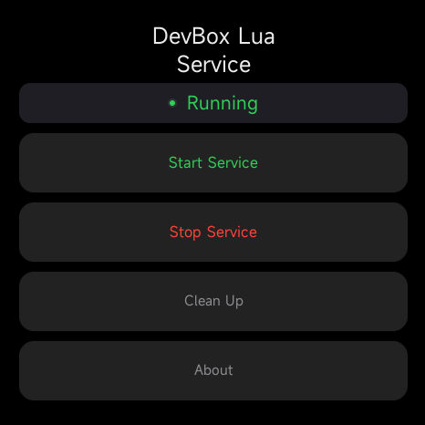

# MiBand DevBox Lua Service
Lua service for DevBox (duh)



## User Interface
Just a few buttons:
- **Start Service**
- **Stop Service**
- **Clean Up** (cleans up created files - mailbox, other activity files)
- **About**

## How It Works
1. `main.lua` creates the application UI and a `Handler` instance.
2. `Handler` discovers device paths and creates the mailbox, router, and polling service.
3. `PollService` invokes `Mailbox:process()` at the configured interval (100ms by default).
4. `Mailbox` checks the state file for `MailboxStates.PENDING`.
5. A pending JSON request is dispatched by `Router` using its `type` field.
6. The selected activity performs the operation and writes the response back to the mailbox.

## Mailbox states
| Value | State |
| ---: | --- |
| `0` | `DONE` |
| `1` | `IDLE` |
| `2` | `PENDING` |
| `3` | `RUNNING` |
| `4` | `ERROR` |
| `5` | `TIMEOUT` |
| `6` | `STREAM` |

## Request Format
Requests are in JSON containing:
- `id` - request ID
- `type` - the target activity
- `args` - arguments passed to the activity

### Example:
```json
{
  "id": 37,
  "type": "io",
    "args": {
        "type": "list",
        "path": "/"
    }
}
```

## Response Format
Responses preserve `id`, `type` and add `res`, `appState`.

### Example:
```json
{
  "id": 37,
  "type": "io",
  "appState": 0,
  "res": {
    "files": [],
    "folders": [
      "bin",
      "data",
      "dev",
    ]
  }
}
```

## Available Activities

| Name | Type | Purpose |
| --- | --- | --- |
| Ping | `ping` | Check that the service is responding |
| Terminal | `cmd` | Execute shell commands |
| File Manager | `io` | File operations and file streaming |
| Sensors | `sensorsLua` | List sensors and sensor data streaming |
| Apps | `apps` | Read and update application lists and manifests; retrieve icons |
| System Info | `sysInfoLua` | Read system information and get/set system properties |
| Lua Shell | `luashell` | Execute Lua code |

Refer to [DevBox docs](addThisAfterItsDone) for available arguments.

## Device Paths

Paths are different across the emulator and real hardware. Valid paths are being checked in `constants/paths.lua`.

## Adding an Activity

1. Create the activity module under `app/lua/router/activities`
2. Give it a unique route `type`
3. Implement its request handling and mailbox response behavior
4. Register it in `app/lua/router/registerActivities.lua`
5. Add any paths to `app/lua/constants/paths.lua`

Activities should validate incoming arguments with `helpers.argsValidator` and return a `MailboxStates` value.

## Compilation
Use [EasyFace](https://github.com/m0tral/EasyFace) to compile this watchface.

## Installation
Refer to [this](addThisAfterMainReadmeIsDone) installation guide

## License

This project is licensed under the GPL v3.0.